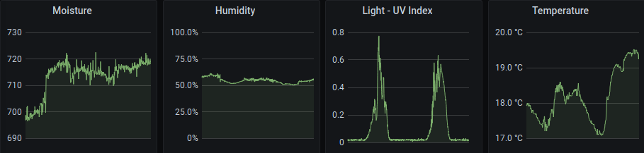

# Plantor - Do you want to have a ~~dry~~ smart plant?

Plantor is a plant monitoring system for Arduino boards. It can be used to monitor indoor plants. 
Used together with [plantor-service](https://github.com/OliLay/plantor-service) it currently visualizes
different sensor outputs, such as moisture of the plant's soil, humidity, temperature and light intensity.

## Hardware
Arduino board with WiFi and enough GPIO pins for the needed sensors, which are
* DFROBOT Capacitive Soil Moisture sensor
* DHT22 Temperature and Humidity sensor
* Adafruit SI1145 Light sensor

Additionally, it makes sense to have some kind of IoT gateway, like a Raspberry Pi
which has the [plantor-service](https://github.com/OliLay/plantor-service) running.

## Prerequisites
`PlatformIO Core` for dependency management.

## Get started
1. Get the hardware
1. Clone this repository
1. Change the config and secrets to your wishes (see [include/config/README.md](https://github.com/OliLay/plantor/tree/master/include/config/README.md))
1. Compile and flash plantor to your board
1. Deploy [plantor-service](https://github.com/OliLay/plantor-service) on your gateway
1. **Important**: Water your plant if plantor tells you to ;)